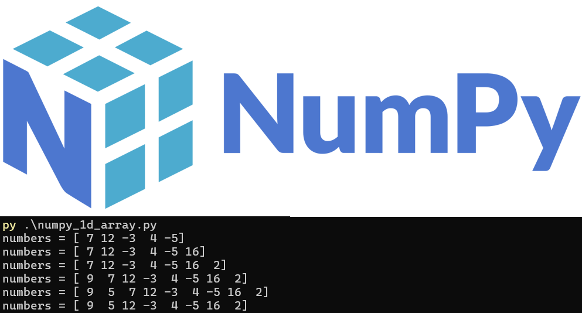

<h3>NUMPY PAKETİ ile 1b-2b DİZİLER ve RASGELE SAYI ÜRETECİ</h3>

<h4>BİLGİSAYARA NUMPY YÜKLEME</h4>
<p align="justify">Bugüne kadar benzer veya ilişkili elemanlara bilgisayarın hafızasında ayrı ayrı değişkenlerle değil de tek bir değişken ismiyle erişmek istediğimizde Python listelerini kullanmıştık. Şimdi burada hızlıca <b>NumPy</b> paketini yükleyip Python listelerinde yaptığımız bir egzersizin aynısını bu sefer NumPy dizileri ve fonksiyonlarıyla gerçekleştireceğiz. İlk önce bilgisayarımıza NumPy paketini PowerShell (PS) konsolundan aşağıdaki gibi yükleyerek işe başlıyoruz.
</p>

```
pip install numpy
```

<h4>NUMPY ile 1b DİZİLER</h4>

<p align="justify">Daha önce Python listelerinde yaptığımız şekilde, verilen bir dizinin değişik yerlerine elemanlar ekleyelim ve değişik yerlerinden elemanları çıkaralım/silelim. Bu arada PowerShell'de hızlıca <b>numbers</b> isimli değişkenin veri tipine <b>type(numbers)</b> fonksiyonu ile bakalım. İlgili videoyu izlemek için <a href="https://www.youtube.com/watch?v=NEWFw1r-e6Y">tıklayınız</a>.</p>



<b>numpy_1d_array.py</b>

```
import numpy as np
numbers = np.array([7, 12, -3, 4, -5])
print(f"numbers = {numbers}")
# listenin sonuna 16 sayısını ekleyelim
numbers = np.append(numbers, 16)
print(f"numbers = {numbers}")
# listenin sonuna 2 ekleyelim
numbers = np.append(numbers, 2)
print(f"numbers = {numbers}")
# listenin başına 9 ekleyelim
numbers = np.insert(numbers, 0, 9)
print(f"numbers = {numbers}")
# listenin başından ikinci sıraya 5 ekleyelim
numbers = np.insert(numbers, 1, 5)
print(f"numbers = {numbers}")
# listenin başından üçüncü elemanı silelim
numbers = np.delete(numbers, 2)
print(f"numbers = {numbers}")
```

<h4>NUMPY ile 2b DİZİLER</h4>

<p align="justify">Aşağıda bize NumPy'da 2b bir dizi verilmekte. Biz bu yapıya doğrusal cebirde <b>matris</b> diyoruz. Resimde gösterilen elemanlara, vektörlere ve alt matrislere aşağıdaki kodda verildiği gibi erişebiliriz. İlgili videoyu izlemek için aşağıdaki matris resmine tıklayınız.</p>


<b>numpy_2d_array.py</b>

```
import numpy as np

A = np.array([[-3, 5, -4, -2, 1, 5, -2, 0, -3, 15],
            [1, 11, 12, 9, 14, 4, -3, 5, 12, 7],
            [6, -2, 14, -4, -5, 8, 5, 9, 0, 4],
            [14, 3, 9, 1, 4, 9, 14, 13, 11, 2],
            [14, 13, 10, -4, 3, 10, 2, 14, 0, 12],
            [-2, 11, 10, -3, 10, 1, 7, 6, 14, 7],
            [14, 14, 3, 11, 11, 9, -1, -2, 2, 6],
            [14, 8, 8, 9, -1, 8, 10, -2, -1, 13]])

print(f"A = {A}")

a = A[-2,1]; print(f"a = {a}")
b = A[:,5]; print(f"b = {b}")
c = A[4,-4:]; print(f"c = {c}")
d = A[-3:,-2]; print(f"d = {d}")
e = A[0:2,-3:]; print(f"e = {e}")
f = A[-3:,3:5]; print(f"f = {f}")
g = A[2:4,:]; print(f"g = {g}")
```

<h3>NUMPY ile RASGELE SAYI ÜRETİMİ</h4>

<h4>NUMPY ile RASGELE MATRİS OLUŞTURMA</h4>

<p align="justify">Elemanları -10 ile 10 arasında (dâhili) değer alan 3 satır 5 sütunluk bir matrisi rasgele bir biçimde <b>numpy</b> ile üretiniz.</p>

```
from numpy.random import randint

r, c = 3, 5 # satır ve sütun sayısı
minA, maxA = -10, 11 # matrisin elemanlarının alabileceği minimum ve maksimum değerler
A = randint(minA, maxA, (r, c)) # r x c boyutunda A matrisini oluştur
print(f"A:\n{A}") # A matrisini ekrana yazdır
```

<p align="justify">Yukarıdaki örnekte kodu koşturduğumuzda o anda rasgele olarak</p>

$$
\left[
\begin{array}{rrrrr}
9 & -8 & -1 & 1 & 10 \\
-9 & 1 & 6 & 10 & -8 \\
-2 & 6 & -3 & 10 & 4
\end{array}
\right]
$$

<p align="justify">matrisini üretti. Bu matrisi manuel olarak <b>numpy</b>'da oluşturmak için aşağıdaki kodu kullanırız.</p>

<b>random_matrix_generation.py</b>

```
import numpy as np
# Üretilen matrisi manuel olarak oluşturalım
A = np.array([[9, -8, -1, 1, 10], [-9, 1, 6, 10, -8], [-2, 6, -3, 10, 4]])
print(f"A:\n{A}") # A matrisini ekrana yazdır
```

<p align="justify">İlgili video için <a href="https://www.youtube.com/watch?v=5yNeR4MZ8ZE">tıklayınız</a>.</p>

<h4>SAYI TAHMİN OYUNU</h4>

<p align="justify">Tahmin etmek istediğimiz sayı bilgisayar tarafından Python'da <b>numpy</b> paketi ile rasgele belirleniyor. Kullanıcı girişle bu sayıyı tahmin etmeye çalışıyor. İlgili videoyu izlemek için <a href="https://www.youtube.com/watch?v=d69tWKi7b6o">tıklayınız</a>.</p>

```
from numpy.random import randint
n = randint(1, 101)  # 1 ile 100 arasında rastgele bir sayı üretelim
while True:
    number = int(input("Bir sayı girin: "))
    if number == n:
        print("Tebrikler! Doğru tahmin ettiniz.")
        break
    elif number < n:
        print("Tahmininiz çok düşük. Sayıyı artırın.")
    else:
        print("Tahmininiz çok yüksek. Sayıyı azaltın.")
```