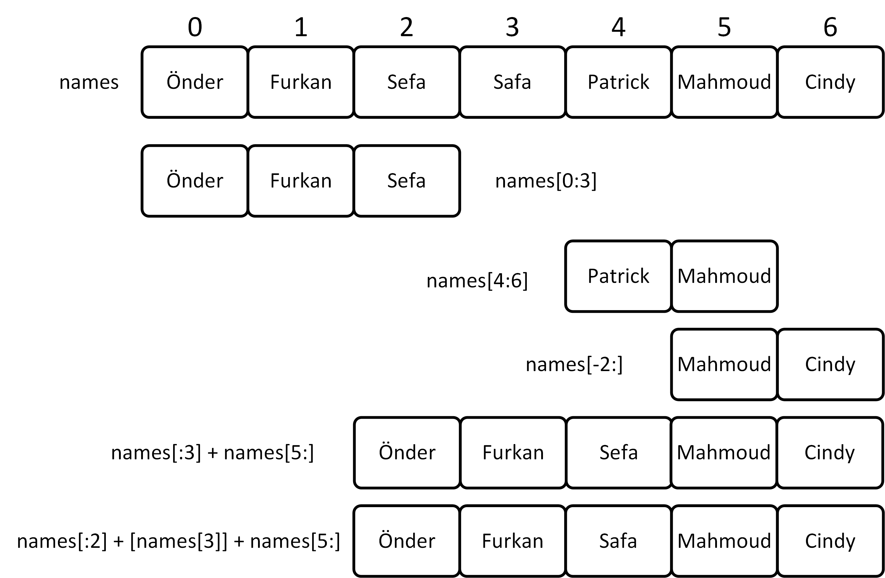

<h3>EEM 114 - TEKRAR</h3>
<p align="justify">Bu bölümde bilgisayarımıza Python resmi web sitesi olan <a href="https://python.org" target="_blank">https://python.org</a> adresinden Python yüklemeyi göreceğiz. Ayrıca PowerShell (PS) kullanımı ve Visual Studio Code (VS Code) yüklemeye de göz atacağız. Yüklemeler tamamlandıktan sonra <b>hello_world.py</b> isimli Python kodumuzu standart bir editörde yazıp PS'de koşturacağız. Ardından ders boyunca kullanacağımız Integrated Development Environment (IDE) olan VS Code'da kodumuzu koşturacağız.</p>

<h3>İLK PYTHON KODUMUZ</h3>

<p align="justify">Ekrana "Merhaba Dünya!" yazdıralım.</p>

<b>hello_world.py</b>

```
print("Merhaba Dünya!")
```

<h3>DEĞİŞKENLER ve BASİT VERİ TİPLERİ</h3>

<p align="justify">Ekrana yine "Merhaba Dünya!" yazdıralım. Fakat bu sefer "Merhaba Dünya!" yazısı kodun içinde bir değişkene atanmış olsun ve bu değişkeni <b>print()</b> fonksiyonuna yollayalım.</p>

<b>hello_world_variables.py</b>

```
message = "Merhaba Dünya!"
print(message)
```

<p>Burada ekrana direkt bir <b>string</b> literal yazdırmak yerine yazdırmak istediğimiz mesajı ilk önce <b>message</b> isminde bir değişkene atadık. Sonrasında bu değişkeni ekrana yazdırdık. Burada <b>message</b> isimli değişkenin veri tipinin <b>string</b> olduğunu aşağıdaki komutla görebiliriz.</p>

```
message = "Merhaba Dünya!"
type(message)
```

<p align="justify">Bu bölümde değişkenlere (variables) ve basit veri tiplerine (data types) bakarken aynı zamanda <b>print()</b> komutuyla ekrana değişkenleri içeren ifadeler yazmayı <b>f-string</b> olarak bilinen <b>formatted string</b> ile yâni <b>formatlanmış string</b> ile yapacağız. Verileri kendimiz kodda oluşturmak yerine konsolda kullanıcıdan <b>input()</b> komutu ile alacağız. Bu komutun döndürdüğü bütün değişkenlerin tipinin <b>string</b> olduğunu görünce tam sayı (integer) ve ondalıklı sayı (floating point number veya decimal number) olarak girilen değerleri nasıl doğru biçimde dönüştürebileceğimizi göreceğiz. Son olarak da yine basit bir veri tipi olan Boolean değişkenlere bakıp ilk <b>if-else</b> koşullu ifademizi yazarak ekranda duruma göre değişiklik gösteren bir yazı yazdıracağız. <b>Eğer-ise</b> şartlı ifadelerinde kullanılan Boolean değişkenler aynı zamanda gelecek haftalarda öğreneceğimiz döngülerde de kullanılacağından Boolean değişkenleri kavramak bizim için çok önemli. Bu sayfadaki kodların koşturulmasını izlemek için <a href="https://youtu.be/ld0Vp_i5u8o">tıklayınız</a>.</p>

<b>user_input_data_types_fstring.py</b>

```
name = input("Kişinin ismi ne? ")
age = int(input(f"{name} isimli kişinin yaşı kaç? "))
weight = float(input(f"{name} isimli kişi kaç kg? "))
x, year, chernobylYear = 5, 2024, 1986
birthYear = year - age
print(f"{name} {birthYear} senesinde doğmuştur.")
print(f"{name} eğer {x}kg daha alırsa {weight+x}kg olacaktır.")
if chernobylYear > birthYear:
    print(f"{name} Chernobyl faciasından önce doğmuştur.")
elif chernobylYear == birthYear:
    print(f"{name} Chernobyl faciasıyla aynı senede doğmuştur.")
else:
    print(f"{name} Chernobyl faciasından sonra doğmuştur.")
```

<p>Yukarıdaki kodun sonuna aşağıda <b>type()</b> komutu içeren satırları ekleyerek dört basit veri tipini ekranda görüntüleyebiliriz. Sınavlarda <b>type()</b> komutu karşımıza çıkacağından mutlaka anlaşılmalı.</p>

```
print(f"type(name) = {type(name)}")
print(f"type(age) = {type(age)}")
print(f"type(weight) = {type(weight)}")
print(f"type(chernobylYear > birthYear) = {type(chernobylYear > birthYear)}")
```

<h4>BASİT BİR LİSTE ve INDEX ile LİSTENİN ELEMANLARINA ERİŞİM</h4>
<p align="justify">İlk önce basit bir liste oluşturalım. Bu liste kişi isimlerinden oluşsun ve ismi <b>names</b> olsun. Dolayısıyla bu listenin elemanlarının veri tipi (data type) string olacaktır. Listenin elemanlarına erişmek için <b>index</b> (Türkçesi <b>fihrist</b>) kullanılır.</p>

<p align="justify">ÖNEMLİ NOT: Bazı arkadaşlarımız normal parantez () ile kare parantezi [] ve dalgalı parantezi {} karıştırıyor. Liste oluştururken İngilizce'de <b>square brackets</b> denilen kare parantez kullanılıyor. Ekrana değişkenleri bastırmak için <b>formatted string</b> diye bilinen f-string kullanmıştık. Bu f-string'lerin içine değişkenleri İngilizce'de <b>curly brace</b> diye bilinen dalgalı parantez kullanarak yerleştirmiştik. Eğer normal parantez kullanılan yerde kare parantez veya dalgalı parantez kullanırsanız veya benzeri bir yanlış yaparsanız o zaman Python kodunuz hata verir.</p>

<b>simple_list.py</b>

```
names = ["Önder", "Furkan", "Sefa", "Safa", "Patrick", "Mahmoud", "Cindy"]
print(f"names = {names}")
print(f"type(names) = {type(names)}")
print(f"names[0] = {names[0]}")
print(f"names[1] = {names[1]}")
print(f"names[2] = {names[2]}")
print(f"names[5] = {names[5]}")
print(f"names[6] = {names[6]}")
print(f"names[-1] = {names[-1]}")
print(f"names[-2] = {names[-2]}")
print(f"type(names[1]) = {type(names[1])}")
print(f"Sınıfta {len(names)} öğrenci var.")
# listedeki isimleri tek tek ekrana yazdıralım
for name in names:
    print(name)
```

<h4>ELEMANLARI DEĞİŞİK VERİ TİPLERİ OLAN LİSTELER</h4>

<p align="justify">Yukarıda ismi <b>names</b> olan elemanlarının veri tipi (data type) <b>string</b> olan bir liste tanımlamıştık. Burada o listeye eşlik eden üç ayrı liste daha tanımlayacağız.</p>

<h5>FOR DÖNGÜSÜ ile LİSTE ELEMANLARINI F-STRING KULLANARAK EKRANA YAZIRMAK</h5>
<p> Bu kısımda birden fazla basit liste tanımlıyoruz. Bu listelerin index'leri aynı olan elemanlarını uygun bir f-string ile mânâlı bir cümle oluşturacak şekilde ekrana yazdırmak için bir <b>for</b> döngüsü kullanıyoruz. Döngüleri henüz öğrenmediğimizden dolayı <b>GitHub Co-Pilot</b>'dan yardım aldık. İlgili video için <a href="https://www.youtube.com/watch?v=KnJXExjCgqE" target="_blank">tıklayınız</a>. Kodun üzerindeki yorumlardan da kodu anlayabilirsiniz.</p>

<b>multiple_list.py</b>

```
names = ["Önder", "Furkan", "Sefa", "Safa", "Patrick", "Mahmoud", "Cindy"]
ages = [20, 21, 21, 20, 23, 25, 24]
weight = [73.6, 75.2, 64.1, 67.9, 71.1, 68.1, 50.3]
attendance = [True, True, True, True, False, True, True]
# for döngüsü ile listedeki öğrencilerin isimlerini, yaşlarını ve kilolarını ekrana yazdıralım
for i in range(len(names)):
    if attendance[i]: # eğer öğrenci mevcut ise bilgileri yazdır
        print(f"{names[i]} {ages[i]} yaşında olup {weight[i]} kg ağırlığındadır.")
    else: # eğer öğrenci yok ise o zaman bilgileri yazdırma
        print(f"{names[i]} bugün sınıfta yoktur.")
```

<h4>BİR LİSTENİN ALT LİSTELERİNE SLICING ile (INDEX'ler KULLANARAK) ERİŞİM</h4>

<p align="justify">Bu kodda <b>names</b> isimli ana listeden <b>INDEX</b> değerlerini kullanarak değişik alt listeleri ve bazı durumlarda bu listelerin kombinasyonlarını kesiyoruz (<b>SLICING</b>). İlgili videoyu izlemek için <a href="https://youtu.be/hDPR_cEmaoM" target="_blank">tıklayınız</a>.</p>

<b>list_slicing.py</b>

```
names = ["Önder", "Furkan", "Sefa", "Safa", "Patrick", "Mahmoud", "Cindy"]
print(f"names = {names}") # isimler listesi
print(f"names[0:3] = {names[0:3]}") # ['Önder', 'Furkan', 'Sefa']
print(f"names[4:6] = {names[4:6]}") # ['Patrick', 'Mahmoud']
print(f"names[-2:] = {names[-2:]}") # ['Mahmoud', 'Cindy']
# Safa ile Patrick isimlerini yazdırmak istemiyoruz. Diğerlerini yazdıralım.
print(f"names[:3] + names[5:] = {names[:3] + names[5:]}") # ['Önder', 'Furkan', 'Sefa', 'Mahmoud', 'Cindy']
# Sefa ile Patrick isimlerini yazdırmak istemiyoruz. Diğerlerini yazdıralım.
print(f"names[:2] + [names[3]] + names[-2:] = {names[:2] + [names[3]] + names[-2:]}") # ['Önder', 'Furkan', 'Safa', 'Mahmoud', 'Cindy']
```



<h4>DİNAMİK LİSTE OLUŞTURMA</h4>

<p align="justify">Listelere ait <b>append()</b> isimli metot ile kullanıcı tarafından girişi yapılan liste elemanlarını sıra sıra listeye kaydedelim ve en sonunda hem <b>len()</b> komutuyla hem de kendi sayıcımızla listenin uzunluğunu hesaplayarak liste ile ekrana basalım. İlgili videoyu izlemek için <a href="https://youtu.be/z_o6j1uvPYU" target="_blank">tıklayınız</a>.</p>

<b>user_input.py</b>

```
names = []

k = 0 # listeye eklenen isimleri kendimiz sayalım
while True:
    s = int(input("İsim eklemek için 1'e, programı sonlandırmak için 2'a basınız: "))
    if s == 1:
        names.append(input("İsim giriniz: "))
        k += 1 # k = k+1
    elif s == 2:
        print("Program sonlandırıldı.")
        break
    else:
        print("Hatalı giriş yaptınız! Lütfen tekrar deneyiniz.")

print(f"names = {names}") # isimler listesi
print(f"names isimli listenin uzunluğu: {len(names)}") # isimler listesinin uzunluğu
print(f"names isimli listenin kendi sayımımıza göre uzunluğu: {k}") # isimler listesinin uzunluğu
```

<h4>SAYI TAHMİN OYUNU (NumPy)</h4>

<p align="justify">Tahmin etmek istediğimiz sayı bilgisayar tarafından Python'da <b>numpy</b> paketi ile rasgele belirleniyor. Kullanıcı girişle bu sayıyı tahmin etmeye çalışıyor. İlgili videoyu izlemek için <a href="https://www.youtube.com">tıklayınız</a>.</p>

```
from numpy.random import randint
y = randint(1, 101)  # 1 ile 100 arasında rastgele bir sayı üretelim
while True:
    x = int(input("Bir sayı girin: "))
    if x == y:
        print("Tebrikler! Doğru tahmin ettiniz.")
        break
    elif x < y:
        print("Tahmininizi artırın.")
    else:
        print("Tahmininizi azaltın.")
```

<h3>KOŞULLU İFADELER ve DÖNGÜLER</h3>

```
flag1, flag2 = False, True
if flag1:
    print("Merhaba!")
elif flag1 and True:
    print("Hola!")
elif flag1 or not flag2:
    print("Hello!")
elif not flag2:
    print("Güle güle dostum.")
elif not flag1 and flag2:
    print("Adios amigo.")
else:
    print("Good bye dude.")
```

<h4>Python Listelerinde Döngü, Koşullu İfade ve String Metotları Egzersizleri</h4>

<p align="justify">Aşağıda ders kitabından aldığımız <b>cars.py</b> kodunu bulabilirsiniz. İlgili video için <a href="https://www.youtube.com/watch?v=g0k7FTxe_3A">tıklayınız</a>.</p>

<p align="justify"><b>cars.py</b></p>

```
cars = ['audi', 'bmw', 'subaru', 'toyota']
for car in cars:
    if car == 'bmw':
        print(car.upper())
    else:
        print(car.title())
```

<p align="justify">Aşağıda ders kitabından aldığımız <b>cars.py</b> kodundan hareketle kendi ürettiğimiz <b>names.py</b> kodunu bulabilirsiniz.</a>.</p>

<p align="justify"><b>names.py</b></p>

```
names = ['Rukiye', 'Handenur', 'Abdullah', 'İbrahim', 'Rana']
for name in names:
    if name[0].lower() == 'r':
        print(name.upper())
    else:
        print(name.lower())
```

<h4>Başka Bir Örnek (if-elif-else koşullu ifadeleri)</h4>

<p align="justify">Kitaptan koşullu ifadelerle ilgili bir başka örnek: <b>hayat.py</b> isimli kodun videosu için <a href="https://www.youtube.com/watch?v=r2GBGGf2aHk">tıklayınız</a>.</p>

<p align="justify">(Hayatın Aşamaları): Bir insanın hayatta hangi aşamada olduğunu belirleyen bir if-elif-else zinciri yazınız. Kullanıcıya yaşını sorarak kullanıcının girdiği değeri <b>age</b> değişkenine atayın ve daha sonra:</p>

<ul>
<li>Kişi 2 yaşından küçük ise bu kişinin bebek olduğunu belirten bir mesajı ekrana yazdırınız.</li>
<li>Kişi en az 2 yaşında ama 4 yaşından küçük ise bu kişinin yürümeye yeni başlayan bir çocuk olduğunu belirten bir mesajı ekrana yazdırınız.</li>
<li>Kişi en az 4 yaşında ama 13 yaşından küçük ise bu kişinin çocuk olduğunu belirten bir mesajı ekrana yazdırınız.</li>
<li>Kişi en az 13 yaşında ama 20 yaşından küçük ise bu kişinin ergen olduğunu belirten bir mesaj ekrana yazdırınız.</li>
<li>Kişi en az 20 yaşında ama 65 yaşından küçük ise bu kişinin yetişkin olduğunu belirten bir mesajı ekrana yazdırınız.</li>
<li>Kişi 65 yaş ve üzeri ise bu kişinin yaşlı olduğunu belirten bir mesajı ekrana yazınız.</li>
</ul>

<p align="justify"><b>hayat_if_elif_else.py</b></p>

```
age = int(input("Kaç yaşındasın? "))
if age < 2:
    print("Daha bebeksin.")
elif age < 4:
    print("Henüz yürümeye başladın.")
elif age < 13:
    print("Çocuksun.")
elif age < 20:
    print("Gençsin.")
elif age < 65:
    print("Yetişkinsin.")
else:
    print("Yaşlısın.")
```

<p align="justify">Another example about the conditional statements (from the course book): <b>stages_in_life.py</b>.</p>

<p align="justify">(Stages of Life): Write an if-elif-else chain that determines a person's stage of life. Get the user's age by asking him/her a related question in the console and assign the entered value to <b>age</b> variable and then:</p>

<ul>
<li>If the person is less than 2 years old, print a message that the person is a baby.</li>
<li>If the person is at least 2 years old but less than 4, print a message that the person is a toddler.</li>
<li>If the person is at least 4 years old but less than 13, print a message that the person is a kid.</li>
<li>If the person is at least 13 years old but less than 20, print a message that the person is a teenager.</li>
<li>If the person is at least 20 years old but less than 65, print a message that the person is an adult.</li>
<li>If the person is age 65 or older, print a message that the person is an elder.</li>
</ul>

<b>stages_in_life.py</b>

```
age = int(input("How old are you? "))
if age < 2:
    print("You are a baby.")
elif age < 4:
    print("You are a toddler.")
elif age < 13:
    print("You are a kid.")
elif age < 20:
    print("You are a teenager.")
elif age < 65:
    print("You are an adult.")
else:
    print("You are an elder.")
```