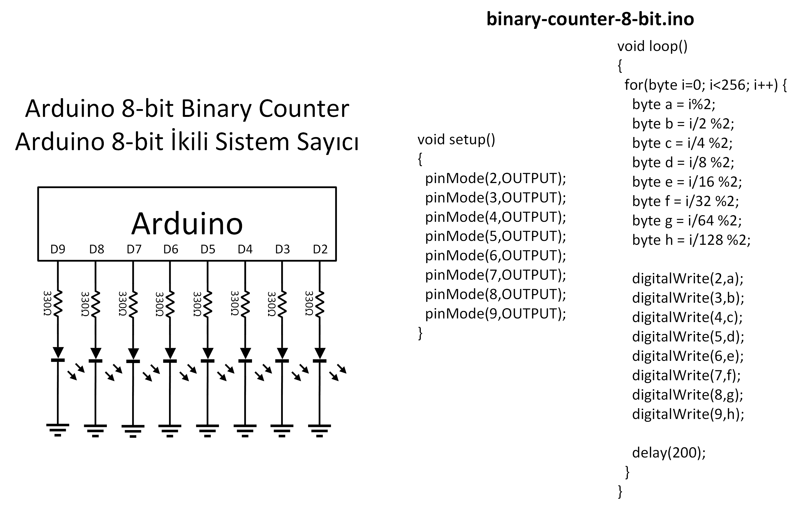
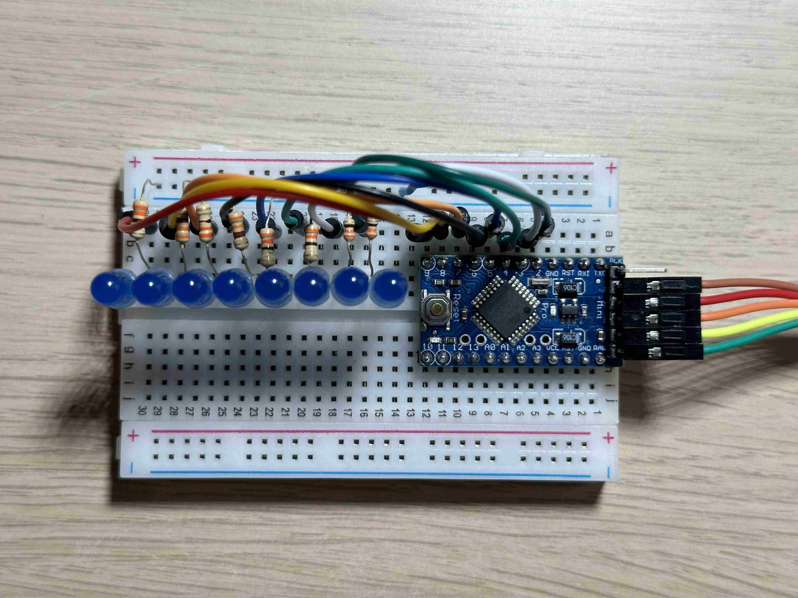
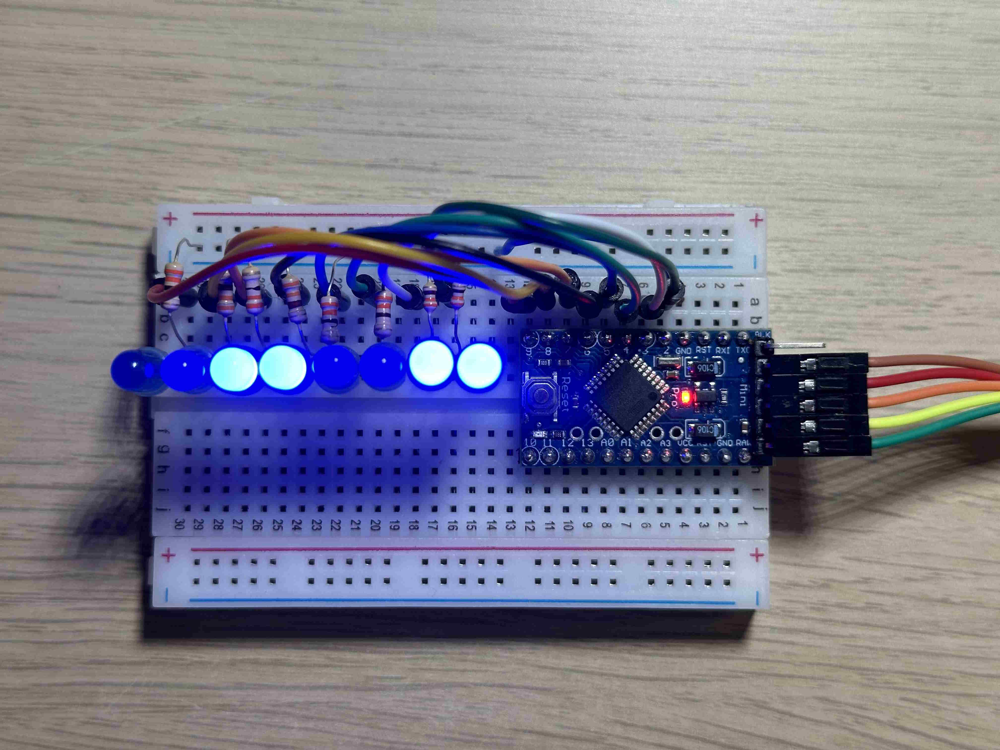
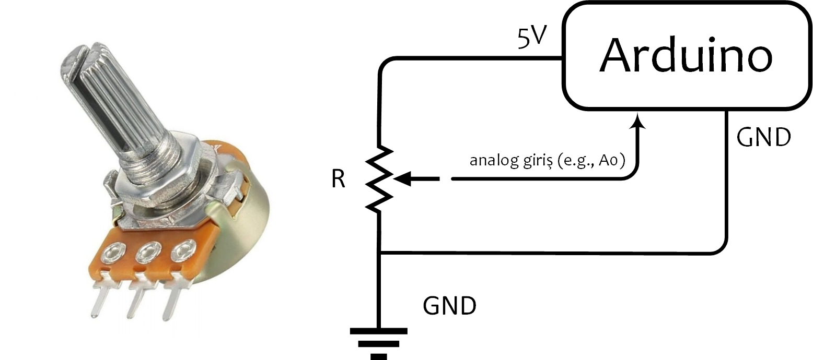
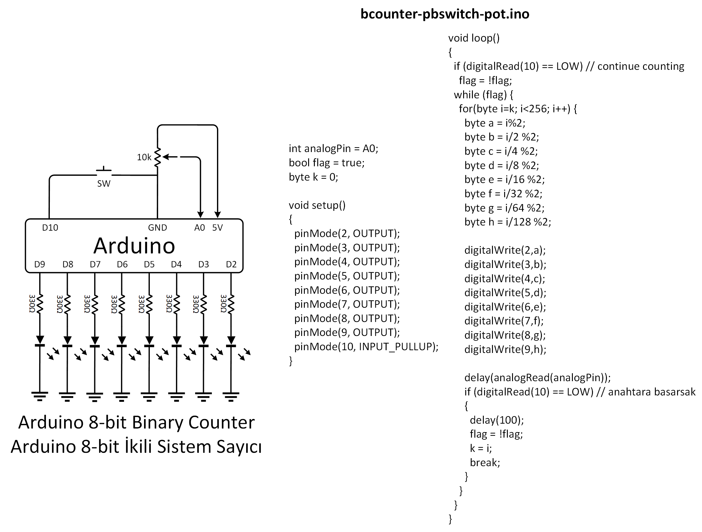
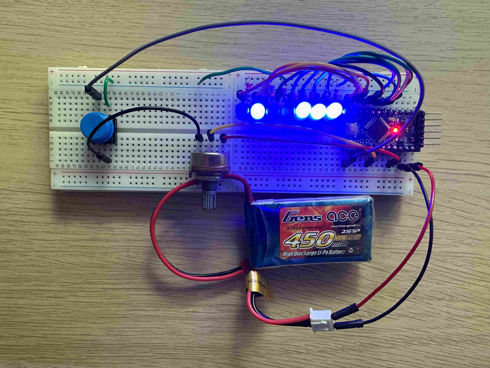
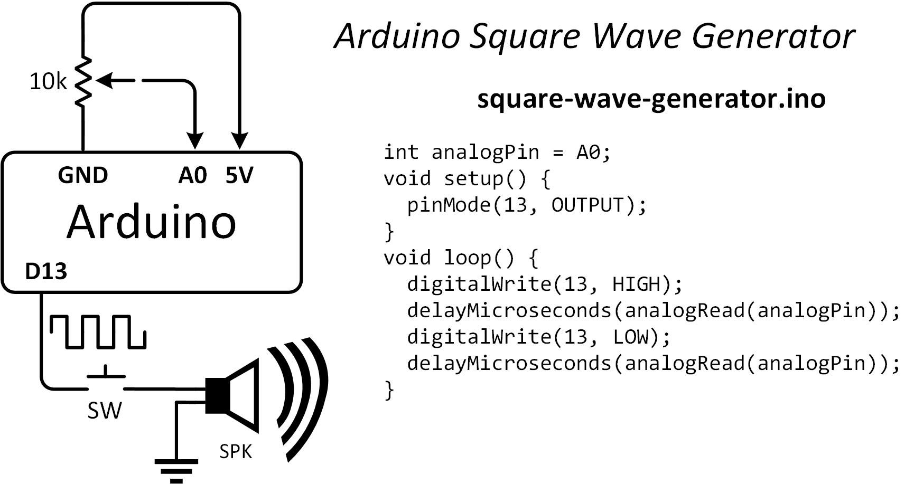
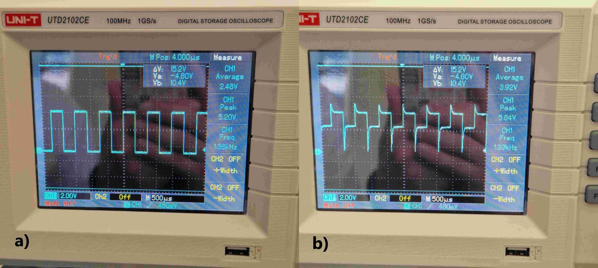

<h3>İkili sistem sayıcı (dijital pinleri çıkış olarak kullanma)</h3>
<h3>Binary Counter (using digital pins as output)</h3>

<p align="justify">Derste <b>binary</b> kelimesinin ikili sistem (yâni 1 ve 0'lardan oluşan sistem) olduğunu göreceğiz. Bu kavramla sayısal tasarım (mantıksal devre tasarımı - logic circuits) dersinde <b>True</b>-<b>False</b> veya logic 0 - logic 1 olarak, Arduino'nun kendi ekosisteminde de özel tanımlanmış anahtar kelimeler olan <b>HIGH</b>-LOW</b> ifadeleri şeklinde karşılaşabilirsiniz. Buna <b>Boolean cebir (Boolean algebra)</b> deniyor. Yapılan ilk deneyi izlemek için <a href="https://youtu.be/s3wDtmzlwCw">tıklayınız.</a></p>

<h4>Örnek Sınav Soruları</h4>
<ul>
    <li align="justify">Aşağıdaki devre şemasında ve verilen kodda <b>setup()</b> fonksiyonunda dijital pinlerin 0'dan başlayarak değil de 2'den başlayarak çıkış olarak tanımlandığını görüyoruz. İlk iki pinin dijital çıkış olarak tanımlanmamasının sebebi ne olabilir?</li>
    <li align="justify">Aşağıdaki devre şemasında <b>loop()</b> foksiyonunda {a, b, c, d, e, f, g, h} değerleri oluşturulurken % operatörünün kullanıldığı görülüyor. Bu operatör neyi temsil ediyor, yâni ne işlev görüyor? Onluk sistemde bir byte'dan büyük olmayan bir sayıyı (e.g., 237) ikili (binary) sisteme çevirdiğiniz bir örnek üzerinde açıklayınız.</li>
</ul>







<b>binary-counter-8-bit-improved.ino</b>

```
void setup() {
  for (int pin = 2; pin <= 9; pin++) {
    pinMode(pin, OUTPUT);
  }
}

void loop() {
  for (byte i = 0; i < 256; i++) {
    byte bits = i;
    for (int pin = 2; pin <= 9; pin++) {
      digitalWrite(pin, bits & 1);
      bits = bits >> 1;
    }
    delay(250);
  }
}
```

<h3>Potansiyometre Kullanımı (Analog Giriş)</h3>
<h3>Using Potentiometer (Anaog Input)</h3>

<h4>Potansiyometre</h4>

<p align="justify">Potansiyometrenin ayarlı direnç olduğunu daha önceki bölüm derslerimizde görmüş olmamız lâzım. Devrelerde gerilim bölücü (voltage divider) olarak vazife gören bu devre elemanının;</p>
<ul>
<li align="justify">Üç bacağı olduğunu,</li>
<li align="justify">İlk ve son bacaklarına Arduino'nun V<sub>cc</sub> +5V ve GND pinlerinin bağlandığını,</li>
<li align="justify">Orta bacağının Arduino'nun analog girişlerinden bir tanesine (e.g., A0) bağlandığını</li>
</ul>

<p align="justify">bilmeliyiz. Analogdan dijitale çevirici (Analog to Digital Converter - ADC) aracılığıyla [0-5V] aralığında sürekli (continuous) değer alan analog sinyalin (potansiyometrenin orta bacağı), Arduino tarafından [0-1023] aralığında bir tam sayıya (integer) dönüştürülerek ayrık (dicrete) bir değer aldığını anlamalıyız. Örnek bir potansiyometre ve anlatılan Arduino bağlantılarını aşağıda görebilirsiniz.</p>



<h3>Binary Counter, Üstten basmalı anahtar ve Potansiyometre</h3>
<h3>Using Toggle Switch as Digital Input and Potentiometer as Analog Input</h3>

<p align="justify">Bir önceki projede kurduğumuz ikili sayıcı devresinde led'lerin yanma süresi sabitti. Bu deneyde ilk deneyimizi bozmadan geliştiriyoruz. Üstten basmalı anahtara basıldığında sayma işleminin durmasını ve serbest bırakıldığında da sayma işleminin devam etmesini istiyoruz. Bunun için D10 pinini dijital giriş (input) olarak kullanacağız. Ayrıca potansiyometreden okunan analog giriş vasıtasıyla Arduino'ya alınan değer <b>delay()</b> fonksiyonunda kullanılarak sayıcının sayma hızını manuel olarak değiştireceğiz. Sayıcı hızı potansiyometreden okuduğumuz değerle doğru orantılı olacak. Potansiyometre ile analog girişin kullanımı aşağıdaki kare dalga üreteci projesinde de yer alıyor. İkinci deneyi izlemek için <a href="https://youtu.be/_aeHYlevhK8">tıklayınız</a>.</p>



<h3>Geliştirilmiş İkili Sistem Sayıcı</h3>

<h3>Improved Binary Counter</h3>

<p align="justify">Bir önceki Arduino deneyinde kodun en sonunda yer alan <b>delay(250)</b> komutuyla ayıcı hızı 250ms'de bir artacak biçimde ayarlanmış ve böylece sayıcı 1s'de 1000 / 250 = 4 sayı ilerlemişti. Bir saniyede dört sayı ilerlerse o zaman [0-255] yâni bir byte sayma süresi hemen hemen 1dk civarı (biraz fazla) olacaktır.</p>

<p align="justify">Bu deneyde bir potansiyometre kullanarak sayıcı hızını kendimiz manuel ayarlamak istiyoruz. Böylece potansiyometrenin üzerindeki ayarlanabilen dönen kısmı kullanarak sayıcı hızını artırıp azaltabileceğiz. Potansiyometreyi Arduino'ya analog girişlerden birinden bağlayacağız.</p>

<p align="justify">Ayrıca sayma işlemi gerçekleştirilirken üzerine basacağımız bir anahtar ile sayma işlemini durdurmak istiyoruz. Tekrar bastığımızda sayma işlemine devam etmesini istiyoruz. Bunun için dijital pinlerden birini giriş (input) olarak kullanacağımızı biliyoruz. Ancak bu düz mantık olmayabilir. Bu noktada karşımıza dijital pinden giriş olarak logic 0 ve logic 1 değerlerini okumada kullanmamız gereken pull-up ve pull-down rezistör kavramları geliyor. Bu donanımsal (devre analizi/tasarımı) ile ilgili ihtiyaç duyulan blgiye ek olarak daha ileri seviye bir konu olan kesme (interrupt) kavramını da bilmemiz gerekiyor. İngilizce'de INTERRUPT SERVICE ROUTINE (ISR) olarak bilinen kesme yardımıyla yukarıda bahsettiğimiz anahtara basınca sayacı durdurma ve (bıraktıktan sonra) tekrar basınca bu sefer de saymaya devam etme işini kolayca yapabiliriz. Özellikle bu kesme konusunda ChatGPT gibi bize kod yazma konusunda yardımcı olabilecek bir yapay zekâdan faydalanacağız. Deneyin bir başka videosunu izlemek için <a href="https://youtu.be/cvJbMj2xaXs">tıklayınız</a>.</p>



<h3>Kare Dalga Üreteci (Square Wave Generator)</h3>

<p align="justify">Bu <a href="https://youtu.be/6WdBsv1CyCg">deneyimizde</a> Arduino dijital çıkışlarından 13 no'lu pin olan D13'e hoparlör (veya buzzer) bağlayarak görev süresi (duty cycle) %50 olan frekansı potansiyometre tarafından manuel olarak ayarlanan kare dalga ürettik.



Bu sinyali üstten basmalı anahtara (push-button switch) bastığımızda işitirken osiloskop ekranında aşağıda görüldüğü gibi iki farklı hâlde görüntüledik: a) Üstten basmalı anahtara basılmadığı (açık devre) durumunda, b) Üstten basmalı anahtara basıldığında (kapalı devre). Bu farklılığın açıklaması için bu <a href="https://www.youtube.com/watch?v=YVkS6jyvlRg">videoyu</a> izleyiniz.</p>



Deneyin push-button switch kullanılmadan yapılan bir başka videosu için <a href="https://youtu.be/1PVWc9H5WxQ">tıklayınız</a>.

<h3>Joystick ile Fırçasız Motor Manuel Hız Kontrolü (PWM sinyali ile)</h3>

<p align="justify">Robotikte karşımıza çıkan motorlardan bazıları DC motor, adım (step) motor, servo motor ve fırçasız (brushless) motorlardır. Bunlardan RC modellerde yâni model uçak, araba, dronlarda sıklıkla kullanılan servo ve fırçasız motorları kontrol etmek için darbe genişlik modülasyonu (pulse width modulation - PWM) denilen bir metot var. Arduino kullanıcıları bu sinyali oluşturmak için özel bir kütüphane oluşturmuş. Bunun ismi Servo kütüphanesi. Arduino üzerindeki dijital pinlerden {3,5,6,9,10,11} no'lu olanlar (Arduino üzerinde ~ işaretinden anlayabilirsiniz) pwm sinyali üretmek için kullanılabilir. Aşağıdaki kodda D9 pininin pwm çıkışı olarak seçildiğini görebilirsiniz.</p>

<b>pwm_motor_control.ino</b>

```
#include <Servo.h>
Servo motor;
int analogPin = A2; // [0-5]V

void setup() {
  motor.attach(9); // pwm sinyali D9
}

void loop() {
   int x = analogRead(analogPin); // [0-1023]
   // int y = map(x, 0, 1023, 0, 180);
   int z = map(x, 0, 1023, 1000, 2000);
   // motor.write(y);
   motor.writeMicroseconds(z);
}
```

<p align="justify">Pinlerden D9 pwm çıkışı olarak fırçasız motora bağlanıyor. Elimizde bulunna eski bir dron kumandasının içine bir tane Arduino Pro Mini koyduk. Dron kumandasında dört adet potansiyometre var. Yâni iki adet joystick ediyor. Bunlardan birisi dronu yukarı-aşağı çıkarmak için kulllanılan THROTTLE denilen kanal. Biz bu potansiyometreyi A2 girişinden okuyup, yâni <b>int x = analogRead(A2)</b> komutuyla [0-5]V --> [0-1023] dönüşümünü yaptıktan sonra, Arduino'nun bize sağladığı map() fonksiyonuyla [1000-2000]us pwm sinyaline çevirip fırçasız motorun ESC denilen motor sürücü devresine uyguluyoruz. İlgili deneyi izlemek için video <a href="https://youtu.be/keFDfk8HNUE">buradadır</a>.</p>

<h3>MPU6050 Hareket Sensörü Kullanımı (Using MPU6050 Motion Sensor)</h3>

<p align="justify">MPU6050 sensörü verisini Arduino'ya <a href="https://github.com/tockn/MPU6050_tockn" target="_blank">MPU6050_tockn</a> kütüphanesi yardımıyla okuyup Euler açılarını Arduino'nun seri port ekranında görüntüledik. Bu kütüphaneden esinlenerek bazı değişik özellikler ekleyip (e.g., sensör örnekleme frekansını ayarlama seçeneği, ivmemetre ve jiroskop verisi hassasiyeti ve max-min ölçüm değerleri) kendi kütüphanemiz olan <a href="https://github.com/mtahakoroglu/MPU6050_ZUPT" target="_blank">MPU6050_ZUPT</a> kütüphanesini oluşturduk. Bu kütüphaneye yapay zekâ yardımıyla yazdırdığımız Python kodlarını da ekleyerek MPU6050 verilerini gerçek zamanda <b>pygame</b> ve <b>matplotlib</b> paketleriyle <a href="https://www.youtube.com/watch?v=-zqW5ccxTFk">görselleştirdik</a>.</p>


<h3>MPU6050 ile hesaplanan yunuslama açısı ile fırçasız motor hız kontrolü (Controlling brushless motor speed using pitch angle estimated with MPU6050)</h3>

<p align="justify">Arkadaşlar, final sınavında bu soruyu soracağız. Kendi geliştirdiğimiz Arduino kütüphanesi olan <a href="https://github.com/mtahakoroglu/MPU6050_ZUPT" target="_blank">MPU6050_ZUPT</a>'da yer alan GetEuler.ino örneğini açıp gerekli Servo kütüphanesi komutlarını yazarak bu işi yapıyorduk. Bununla ilgili örnek video'yu kısa bir süre içinde buradan izleyebilirsiniz. <b>Not:</b> Bu kodu da kendi Arduino'larına yazıp fırçasız motorun hızını MPU6050 ile kontrol edenler final sınavından bir 20 puanı daha garantileyebilirler.</p>

### MPU6050 ile Kontrol Edilen Robot

<p align="justify">Bu projenin kumanda devresini kurup, Arduino'yu ilgili depodaki <a href="https://github.com/mtahakoroglu/gumushane-eem-216/blob/main/project/gesture-robot/transmitter/transmitter.ino">transmitter.ino</a> kodu ile programlayıp robotu nRF24l01 aracılığıyla MPU6050 ile kontrol edenler final sınavının 20 puanını almış sayılıyorlar.</p>


Projenin videosuna <a href="https://www.youtube.com/watch?v=fec-XFwayz8&list=PLMoe16OQDeeCD2FydKfOrbsncrZ93XZBb&index=2">gesture robot</a> bağlantısından ulaşabilirsiniz.