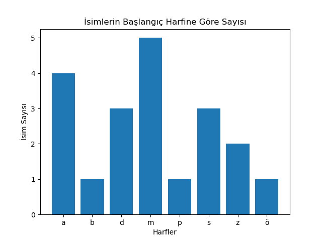

<h3>HAFTA 14: FONKSİYONLAR ve MATPLOTLIB KULLANIMI</h3>

<p align="justify">Geçtiğimiz hafta kendi fonksiyonlarımızı (user-defined function) yazmaya başladık. Bu hafta fonksiyonlar konusunda egzersizlerle devam ederken <b>matplotlib</b> paketi ile de grafik (histogram) çizdirmeyi göreceğiz. Veriyi görselleştirmek için <b>matplotlib</b> kullanırken tamamen <b>GitHub Copilot</b> kod yazma asistanından yardım alacağız.</p>

<p align="justify">Burada örnek bir sınav sorusu çözelim. İlgili video için <a href="https://www.youtube.com/watch?v=Nn9cd6eWTqw">tıklayınız.</a>

<p align="justify">Aşağıda bir isim listesi verilmiştir.</p>

```
names = ["ALİ", "burak", "tabarak", "derya", "patrick",
         "sefa", "zeliha", "Serhat", "taha", "sude", 
         "melisa", "Mert", "Deniz", "demir", "mesut", 
         "alperen", "zeynep", "mehmet", "merve", "ayşe"]
```

<p align="justify">Kodun devamında ilk önce bu listeyi ekrana basalım.</p>

```
print(f"İsim listesi {names}")
```

<p align="justify">Ardından kullanıcıya bir soru soralım.

```
letter = input("Hangi harf ile başlayan isimlerin istatistiğine bakmak istersiniz? ")
```

<p align="justify">Burada <b>name_stats()</b> isimli bir fonksiyon tanımlayınız. Bu fonksiyona giriş olarak (yâni argüman olarak) <b>names</b> ve <b>letter</b> değişkenlerini (isim listesini ve ilgilendiğimiz harfi) veriniz. Çıkış olarak <b>name_stats()</b> fonksiyonu bize <b>letter</b> harfi ile başlayan isim sayısını ve bu harfle başlayan isim listesini döndürmeli. Fonksiyonu aşağıdaki gibi çağırıp son olarak da döndürülen değerleri ekrana basmalıyız.</p>

```
n, new_list = name_stats(names, letter)
print(f"{letter} harfi ile başlayan isim sayısı = {n}")
print(f"{letter} harfi ile başlayan isimlerin listesi {new_list}.")
```

<p align="justify">
Soru – devam (5 Puan) Grafik çizdirmede kullanacağımız <b>matplotlib</b> paketiyle <b>GitHub Copilot</b>'ın asistanlığında aşağıdaki yorumu koda ekleyerek <b>names</b> isimli listenin histogramını çizdiriniz.</p>

```
# İsimleri başlangıç harfine göre sayıp alfabetik olarak bar grafiğinde gösterelim
```

